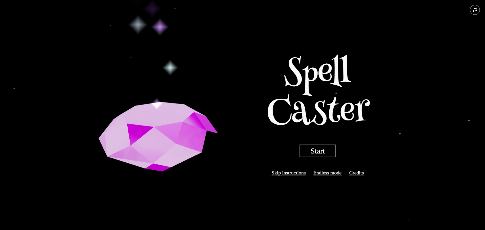
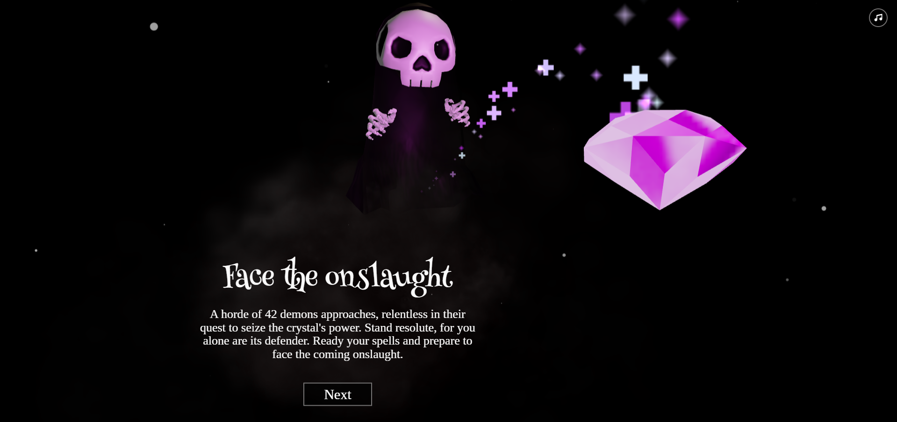
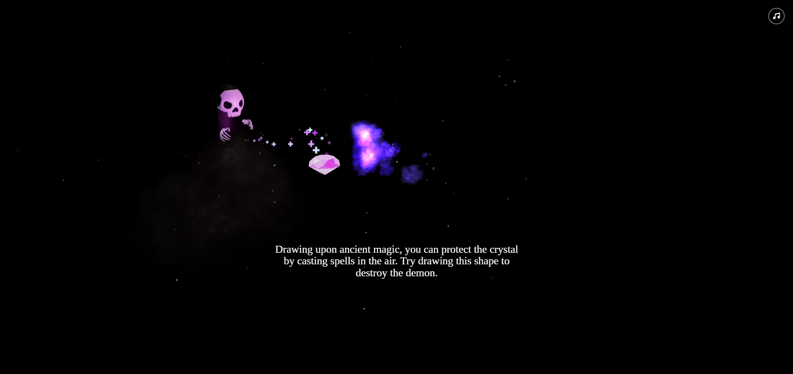
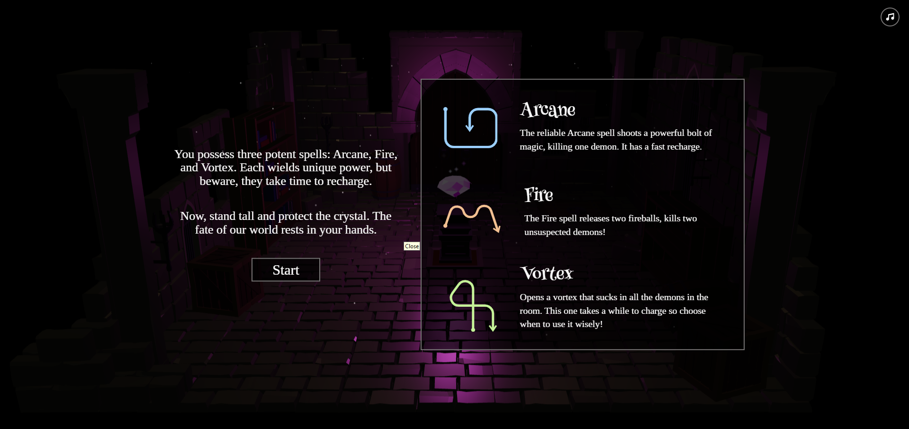
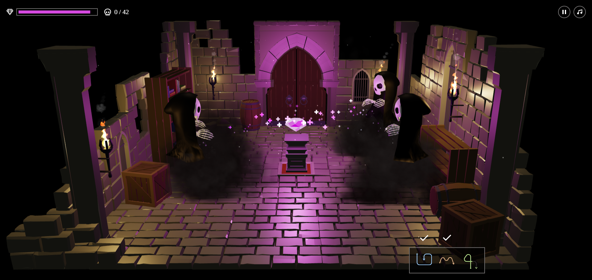

# Spell Caster game - by SijanProg
Simple Game using HTML, CSS, and JavaScript

This is a simple game created using HTML, CSS, and JavaScript. The game utilizes various technologies and libraries for animation and rendering.

## Technologies Used

- AnimationMixer
- Clock
- PointLight
- AmbientLight
- ColorManagement
- DirectionalLight
- Group
- LinearSRGBColorSpace
- Mesh
- PCFSoftShadowMap
- PerspectiveCamera
- ReinhardToneMapping
- Scene
- ShaderMaterial
- WebGLRenderer
- Color
- Raycaster
- ArrowHelper
- Box3
- Box3Helper
- ConeGeometry
- DoubleSide
- MeshBasicMaterial
- MeshMatcapMaterial
- Plane
- Vector2
- AdditiveBlending
- BufferAttribute
- CustomBlending
- OneFactor
- Points
- ZeroFactor
- AxesHelper
- BufferGeometry
- TubeGeometry
- CatmullRomCurve3
- Vector3
- PlaneGeometry
- Audio
- AudioListener
- SphereGeometry
- LoadingManager
- TextureLoader
- AudioLoader

## About the Game

[This game a simple webgame for improve my tech stack]

## How to Play

[Clink simple link : crystal-h.vercel.app.]

## Getting Started

To run the game locally, follow these steps:

1. Clone this repository.
2. Open the `index.html` file in your web browser.
3. Enjoy playing the game!

## Contributing

Contributions are welcome! If you'd like to contribute to this project, please follow these steps:

1. Fork the repository.
2. Create a new branch (`git checkout -b feature/your-feature`).
3. Make your changes.
4. Commit your changes (`git commit -am 'Add new feature'`).
5. Push to the branch (`git push origin feature/your-feature`).
6. Create a new Pull Request.

## License

[This project is open-source and contributions are free. Feel free to use, modify, and distribute it as you wish.]

# Some demo picture 

 

 

 

 

